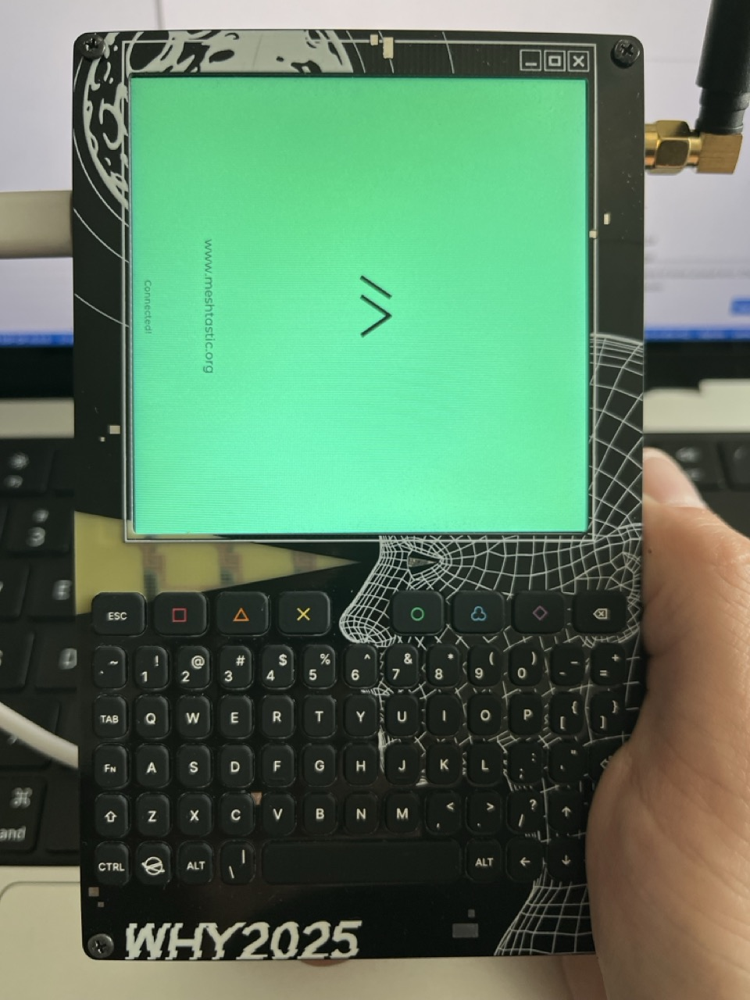

# Meshtastic UI loader for WHY2025 badge

Work in progress: trying to port Meshtastic UI to the WHY2025 badge.

TODO document more 

## What is this

Note: this runs on the M.2 board and is just the gui. 

LoRA modem is connected to the ESP32-C6 on the carrier board.

You will need to solder 2 wires and flash firmware to the C6.

https://wiki.why2025.org/Project:Meshtastic_on_the_WHY2025_badge

You also will need to enable serial in Protobufs mode on pins

Firmware repos (either one should work):
https://github.com/pkoryzna/meshtastic-firmware-why2025-carrier/

https://github.com/n0p/mesthastic-fw-why-badge/tree/why2025-badge

## Current progress



uart seems to connect, try to connect again and then ui gets stuck :(

My hunch is it is some serial callback getting called before some gui object becomes non-NULL or so.
Also the assertion failure in `lv_label_set_text` would support that?

It does this in either multi or single core mode.

```
DEBUG | 00:01:14  73 [TFT] UARTClient connecting...
ERROR | 00:01:14  73 [TFT] [Error]      (70.420, +69560)         lv_label_set_text: Asserted at expression: obj != NULL (NULL pointer) lv_label.c:135

E (79780) task_wdt: Task watchdog got triggered. The following tasks/users did not reset the watchdog in time:
E (79780) task_wdt:  - IDLE (CPU 0)
E (79780) task_wdt: Tasks currently running:
E (79780) task_wdt: CPU 0: loopTask
E (79780) task_wdt: Print CPU 0 (current core) registers
Core  0 register dump:
MEPC    : 0x4006f81e  RA      : 0x4006f81e  SP      : 0x4ff3d700  GP      : 0x4ff15a00  
--- 0x4006f81e: lv_label_set_text at /Users/patryk/projects/meshtastic-ui-why-m2/managed_components/lvgl__lvgl/src/widgets/label/lv_label.c:135
--- 0x4006f81e: lv_label_set_text at /Users/patryk/projects/meshtastic-ui-why-m2/managed_components/lvgl__lvgl/src/widgets/label/lv_label.c:135
TP      : 0x4ff3d800  T0      : 0x4fc0a9f8  T1      : 0x4ff3cf2c  T2      : 0x00000000  
--- 0x4fc0a9f8: UartSecureDwnLdProc in ROM
S0/FP   : 0x00000000  S1      : 0x400c7590  A0      : 0x00000001  A1      : 0x00000000  
A2      : 0x00000000  A3      : 0x00000001  A4      : 0x00000000  A5      : 0x4ff1f044  
A6      : 0x4000d2e4  A7      : 0x0000000a  S2      : 0x4001a34a  S3      : 0x00000000  
--- 0x4000d2e4: usb_serial_jtag_write at /Users/patryk/esp/esp-idf/components/esp_driver_usb_serial_jtag/src/usb_serial_jtag_vfs.c:184
--- 0x4001a34a: TFTView_320x240::messageAlert(char const*, bool) at /Users/patryk/projects/meshtastic-ui-why-m2/components/DeviceUI/source/graphics/TFT/TFTView_320x240.cpp:5531
S4      : 0x00000000  S5      : 0x00000000  S6      : 0x00000000  S7      : 0x00000000  
S8      : 0x00000000  S9      : 0x00000000  S10     : 0x00000000  S11     : 0x00000000  
T3      : 0x00000000  T4      : 0x00000000  T5      : 0x0000000a  T6      : 0x00000000  
MSTATUS : 0x00001888  MTVEC   : 0x4ff00003  MCAUSE  : 0xdeadc0de  MTVAL   : 0xdeadc0de  
--- 0x4ff00003: _vector_table at ??:?
MHARTID : 0x00000000 
```

## How to build

Clone and init submodules.

Install ESP-IDF v5.5 and use the regular build command.

## Why not just build meshtastic-standalone-ui for P4?

I could not get it to work with platformio or pioarduino, so I'm trying with ESP-IDF.