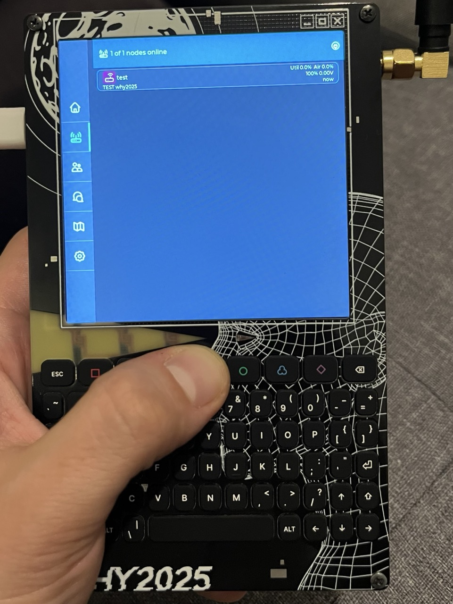

# Meshtastic UI standalone for WHY2025 badge

Work in progress: trying to port Meshtastic UI to the WHY2025 badge.

TODO document more 

## What is this

Note: this runs on the M.2 board and is just the gui. 

LoRA modem is connected to the ESP32-C6 on the carrier board.

You will need to solder 2 wires and flash firmware to the C6 first.

https://wiki.why2025.org/Project:Meshtastic_on_the_WHY2025_badge


Firmware repo:
https://github.com/pkoryzna/meshtastic-firmware-why2025-carrier/


It should also work with this version, but will need to enable serial in Protobufs mode:

```
meshtastic --set serial.enabled true --set serial.baud 38400 --set serial.mode PROTO
meshtastic --set serial.rxd 17 --set serial.txd 16
```

https://github.com/n0p/mesthastic-fw-why-badge/tree/why2025-badge


## Current progress/issues



- UART connects and UI shows up, seems functional. Please test.

- After first boot after flash/factory reset, there will be another reboot (some setting gets applied, I didn't check what yet.)

- Keyboard driver works but the UI doesn't use arrow keys for navigation (I think there isn't an official device with arrow keys?) 

- Would be nice to automatically flash C6 so users have to flash only th P4, like BadgeVMS does.

- Display backlight is (ab)using the status LED functionality of FW running on the C6.
  Blink for OK makes the backlight turn off for a split second.
  Would be good to make that independent - GPIO control over custom protobuf messages?

- WiFi is untested.

### Extra keybindings for badge "function" keys
|Key|Alternate key|Function|
|---|---|---|
|ESC       |            |Exit (dropdowns etc.)|
|□ Square  |            |Go to beginning of line (Home)|
|△ Triangle|            |Go to end of line (End)|
|✕ Cross   |Shift+⌫     |Delete|
|○ Circle  |Shift+Tab   |Focus previous item|
|☁︎ Cloud   |Tab         |Focus next item|
|◇ Diamond |Enter       |Select item|
|⌫ Backspace|           |Delete character left of the cursor (wow)|

Shift keys are not sticky, you have to hold either to enter UPPERCASE.

CTRL, PLANET, Fn, ALT do nothing at the moment. [TODO :)](components/DeviceUI/source/input/TCA8418KeyboardInputDriver.cpp)

## How to build

Clone and init submodules.

Install ESP-IDF v5.5 and use the regular `idf.py` commands like `build` etc.

## Why not just build meshtastic-standalone-ui for P4?

I could not get it to work with platformio or pioarduino, so I'm trying with ESP-IDF.
