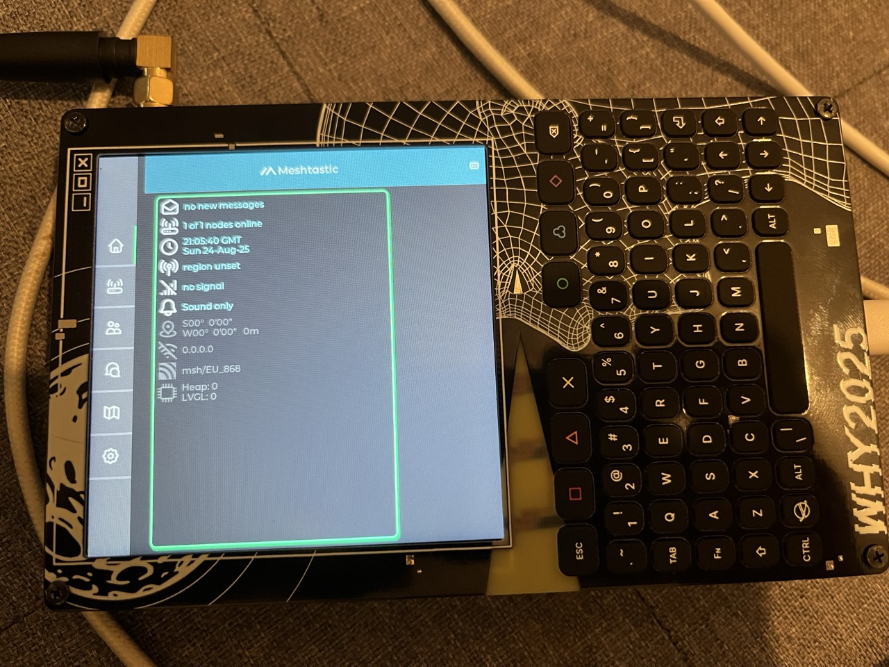

# Meshtastic UI loader for WHY2025 badge

Work in progress: trying to port Meshtastic UI to the WHY2025 badge.

TODO document more 

## What is this

Note: this runs on the M.2 board and is just the gui. 

LoRA modem is connected to the ESP32-C6 on the carrier board.

You will need to solder 2 wires and flash firmware to the C6.

https://wiki.why2025.org/Project:Meshtastic_on_the_WHY2025_badge


Firmware repo:
https://github.com/pkoryzna/meshtastic-firmware-why2025-carrier/


It should also work with this version, but will need to enable serial in Protobufs mode:

```
meshtastic --set serial.enabled true --set serial.baud 38400 --set serial.mode PROTO
meshtastic --set serial.rxd 17 --set serial.txd 16
```

https://github.com/n0p/mesthastic-fw-why-badge/tree/why2025-badge


## Current progress



- UART connects and UI shows up, 

- but it keeps rebooting because it updates some setting on start which causes the FW on C6 to reboot...

- Screen is not rotated the right way up. Right now, up is towards right.

- Keyboard driver is not finished so there's no input working yet.

## How to build

Clone and init submodules.

Install ESP-IDF v5.5 and use the regular `idf.py build` (etc) commands.

## Why not just build meshtastic-standalone-ui for P4?

I could not get it to work with platformio or pioarduino, so I'm trying with ESP-IDF.