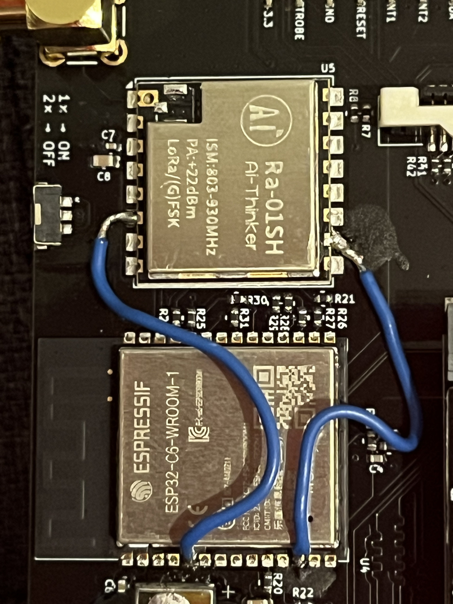

# Meshtastic UI standalone for WHY2025 badge

Meshtastic Firmware+UI port for the WHY2025 badge.

## Installation

### Hardware

SMA socket and antenna **MUST** be installed before running Meshtastic
and transmitting anything. Radio can be damaged otherwise!

The badge as assembled at the camp must have 2 connections added
between ESP32-C6 chip and the LoRA module. 

This is documented in the original WHY2025 Wiki article: https://wiki.why2025.org/Project:Meshtastic_on_the_WHY2025_badge

| C6 pin | Radio pin | Function     |
|--------|-----------|--------------|
| 5      | 6         | GPIO5 - CAD  | 
| 12     | 10        | GPIO11 - BUSY |

In order to enable vibration (not implemented yet), move resistor R53 to R49 on the IO3,
i.e. bridge the `VIB` pads. _TODO picture_

[As noted on the wiki](https://wiki.why2025.org/Badge/LoRa-Antenna) - the bundled antenna
can be quite bad on 868 band in EU, consider replacing it (or tuning.)

### Flashing

Simplest way with web flasher and Chrome-based browser: https://pkoryzna.github.io/meshtastic-ui-why-m2/

For other OSes:

- install [esptool.py](https://docs.espressif.com/projects/esptool/en/latest/esp32p4/index.html) for your OS
- [go to the latest release](https://github.com/pkoryzna/meshtastic-ui-why-m2/releases/latest)
  and download the `meshtastic-fw-why-badge-m2-$VERSION.bin` file
- connect the badge's **left** USB-C port to your computer 
- flash the binary with `esptool.py write_flash 0x00 meshtastic-fw-why-badge-m2-$VERSION.bin`

## Current progress/issues

- Internally UART connects and UI shows up, mostly functional. Please test.

- Some UI functionality seems to be exclusively available through touch. 
It's possible to "soft-lock" yourself out of some things. TODO

- for example if you don't have the map tiles on SD card the silly banner will cover up the screen (TODO turn it off)

- UI is not built for keyboard navigation. We'll need to fix that in device-ui upstream eventually.

- C6 automatically gets flashed so users have to flash only th P4, like BadgeVMS.
**The first bootup can take a few minutes due to this flashing process.** 

- Display and KB backlight is currently hacked into the C6 FW. 
There is no easy way to enable it during flashing at the moment.

- After first boot after flash/factory reset, there will be another reboot after Meshtastic UI applies some settings.

- Arrow keys navigation is a bit tricky. Use Up/Down to navigate between UI element, 
and Left/Right to adjust sliders, select list items in settings, move text cursor etc.  

- WiFi is unstable and untested for now.

- USB Serial connection works. Use the **bottom** USB-C port. 

- Bluetooth connection works. You can use the CLI or web client with a serial connection
  to toggle BLE status and set the PIN.

- Bluetooth toggling from UI (aka Programming Mode) is currently unstable; 
sometimes it leaves BLE enabled without showing the PIN on screen,
for now it does not show up in the power menu.

- Power is managed externally by the PMU a.k.a. "power bank chip" on the carrier board, 
soft shutdown is not supported. 
Double-tapping tapping the power button will always shut down the whole badge.

### Keybindings

|Key| Alternate keys      |Function|
|---|---------------------|---|
|ESC       |                     |Exit (dropdowns etc.)|
|□ Square  |                     |Go to beginning of line (Home)|
|△ Triangle|                     |Go to end of line (End)|
|✕ Cross   | Shift+⌫             |Delete|
|○ Circle  | Shift+Tab, Up arrow |Focus previous item|
|☁︎ Cloud   | Tab, Down arrow     |Focus next item|
|◇ Diamond | Enter               |Select item|
|⌫ Backspace|                     |Delete character left of the cursor (wow)|

Shift keys are not sticky, you have to hold either to enter UPPERCASE.

CTRL, PLANET, Fn, ALT do nothing at the moment. [TODO :)](components/DeviceUI/source/input/TCA8418KeyboardInputDriver.cpp)

## How to build

Clone and init submodules recursively.

Install ESP-IDF v5.5 and use the regular `idf.py` commands like `build` etc.

## Why not just build meshtastic-standalone-ui for P4?

I could not get it to work with platformio or pioarduino, so I'm trying with ESP-IDF.
